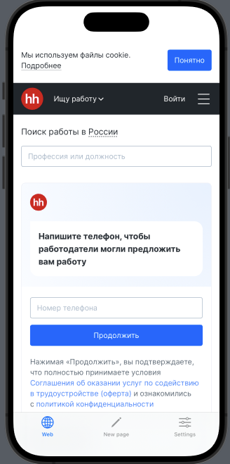
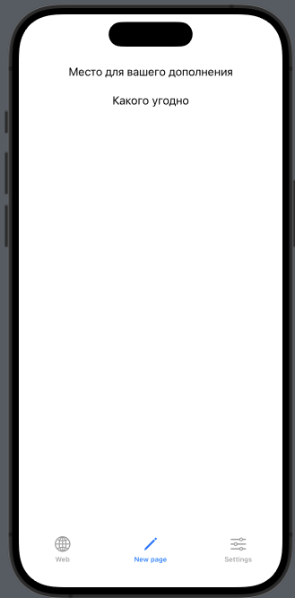
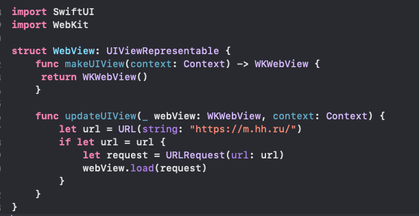

# WebVieweDemo(Swift UI) 
Резюме: WebVieweDemo это пробный проект для наглядного примера работы WebViewe при использовании SwiftUI.

## Введение

Данный проект показывает схематичное описание работы прилежний которые используют веб вью.
Репозиотрии тестовый.

### Картинки

Первая старница идет как брузерное посещение сайта 

Вторую обычно наполняют смежным функиолналом

Это объект для возможности внедрения в SwiftUI интерфейс

